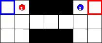
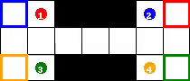

---

---

<h1 id="multi-agent-proximal-policy-optimisation">Multi-Agent Proximal Policy Optimisation</h1>

Proximal policy optimisation (PPO) is one of the most effective algorithms for single and multi-agent reinforcement learning. Here it is implemented for the switch2-v0 and switch4-v0 environments in <a href="https://github.com/koulanurag/ma-gym">ma-gym</a>.

With very little hyperparameter tuning and relatively little training, the algorithm converged reliably to the optimal solution for both problems.

<strong>Switch2-v0 solution</strong> 

<strong>Switch4-v0 solution</strong> 

<h4 id="references">References</h4>

<a href="https://arxiv.org/abs/1707.06347">https://arxiv.org/abs/1707.06347</a> 
<a href="https://openai.com/blog/openai-baselines-ppo/#ppo">https://openai.com/blog/openai-baselines-ppo/#ppo</a>

